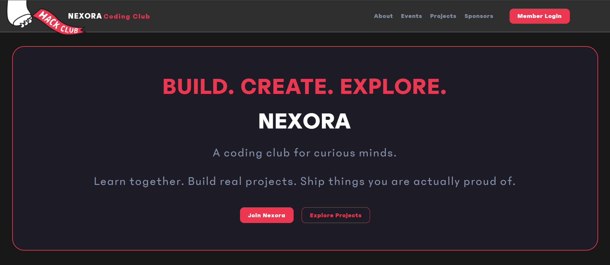

# NEXORA

It's a student-led coding club under Hack Club where students can learn while building.

## Live Demo and Github Repository Link:

[Live Demo] (https://srishtiongit.github.io/NEXORA/)
[Github Repo] (https://github.com/SrishtiOnGit/NEXORA)

## About NEXORA :

1. It's a website made for a student-led coding club which is ubder Hack Club where students can learn via experiments exclusive of tutorials.
2. I made it to provide a identity through a website to my club.
3. I think the designing I gave it is much more cool as I have tried this out and understood my code.

## Tech Stack -

1. React + Vite
2. CSS
3. React Router

## Features :

Though it doesn't have any feature except routing as it's a normal website.

## Preview :



## Steps to Run Locally :

**Prerequisites** :

1. Node
2. npm

**Installation** :

```bash
git clone https://github.com/SrishtiOnGit/NEXORA.git
cd client
npm install
npm run dev
```

**_Author_** : [Srishti Srivastava](https://github.com/SrishtiOnGit)
